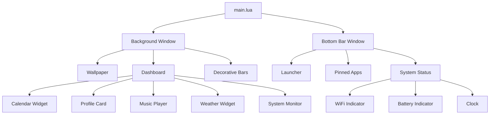

## System Overview

CandyShell is a Wayland desktop shell built with **GTK4**, **Lua**, and **gtk4-layer-shell**. It provides a modern, customizable desktop environment with dynamic theming, media controls, system monitoring, and an extensible widget system.

<Note>
  CandyShell uses LGI (Lua GObject Introspection) to interface with GTK4 and other GObject-based libraries, enabling full access to GNOME platform APIs from Lua.
</Note>

## Core Architecture

### Application Entry Point

The shell initializes through `main.lua:160-324`, which sets up the GTK4 application and Layer Shell windows:

```lua
-- main.lua:2-10
local ffi = require("ffi")
ffi.C = ffi.load("gtk4-layer-shell")

local lgi = require("lgi")
local Gtk = lgi.require("Gtk", "4.0")
local LayerShell = lgi.require("Gtk4LayerShell", "1.0")
local Adw = lgi.require("Adw")
```

<Accordion title="Application Structure">
  The application consists of two main windows:
  
  1. **Background Window** (`bg_win`) - Layer Shell BACKGROUND layer
     - Anchored to all edges (full screen)
     - Contains wallpaper, dashboard, and decorative bars
     - Handles wallpaper selection and theme mode switching
  
  2. **Bottom Bar Window** (`bar_win`) - Layer Shell TOP layer
     - Anchored to bottom edge only
     - Contains launcher, pinned apps, and system status
     - Auto-exclusive zone for proper window management
</Accordion>

### Layer Shell Integration

CandyShell uses `gtk4-layer-shell` to position windows in Wayland compositor layers:

<Tabs>
  <Tab title="Background Layer">
    ```lua
    -- main.lua:171-181
    LayerShell.init_for_window(bg_win)
    LayerShell.set_layer(bg_win, LayerShell.Layer.BACKGROUND)
    LayerShell.set_exclusive_zone(bg_win, -1)
    LayerShell.set_anchor(bg_win, LayerShell.Edge.LEFT, true)
    LayerShell.set_anchor(bg_win, LayerShell.Edge.RIGHT, true)
    LayerShell.set_anchor(bg_win, LayerShell.Edge.TOP, true)
    LayerShell.set_anchor(bg_win, LayerShell.Edge.BOTTOM, true)
    ```
    
    The background window is anchored to all edges with exclusive zone `-1`, meaning it doesn't reserve space and allows other windows to overlap it.
  </Tab>
  
  <Tab title="Top Bar Layer">
    ```lua
    -- main.lua:273-284
    LayerShell.init_for_window(bar_win)
    LayerShell.set_layer(bar_win, LayerShell.Layer.TOP)
    LayerShell.set_anchor(bar_win, LayerShell.Edge.LEFT, true)
    LayerShell.set_anchor(bar_win, LayerShell.Edge.RIGHT, true)
    LayerShell.set_anchor(bar_win, LayerShell.Edge.BOTTOM, true)
    LayerShell.set_margin(bar_win, LayerShell.Edge.BOTTOM, 3)
    LayerShell.auto_exclusive_zone_enable(bar_win)
    ```
    
    The bar window uses `auto_exclusive_zone_enable` to automatically reserve space, preventing other windows from overlapping it.
  </Tab>
</Tabs>

## Module System

### Core Modules

CandyShell's functionality is organized into modules in the `libs/` directory:

```lua
-- main.lua:12-16
local SystemInfo = require('libs.system_i')
local NetworkManager = require('libs.nm')
local GApps = require('libs.gapps')
local Theme = require('libs.theme')
local Dashboard = require("dashboard")
```

<CardGroup cols={2}>
  <Card title="System Integration" icon="microchip">
    **libs/system_i.lua** - System information via GTop and UPowerGlib
    - CPU usage monitoring (`get_cpu_used`)
    - Memory statistics (`get_mem_info`)
    - Disk usage (`get_disk_usage`)
    - Battery status (`get_battery_info`)
  </Card>
  
  <Card title="Theme Engine" icon="palette">
    **libs/theme.lua** - Dynamic theming via matugen
    - Wallpaper-based color extraction
    - Light/dark mode switching
    - CSS color variable generation
    - Settings persistence
  </Card>
  
  <Card title="Media Control" icon="music">
    **libs/music.lua** - MPRIS integration via Playerctl
    - Player metadata access
    - Playback controls
    - Album art extraction
    - Color analysis for adaptive UI
  </Card>
  
  <Card title="Network Status" icon="wifi">
    **libs/nm.lua** - NetworkManager integration
    - WiFi connection status
    - Signal strength monitoring
    - Network configuration
  </Card>
</CardGroup>

### Module Loading Pattern

The `libs/init.lua` provides a centralized module loader:

```lua
-- libs/init.lua
local M = {}

M.Music = require("libs.music")
M.System_Info = require("libs.system_i")
M.SwayIPC = require("libs.sway")

return M
```

## Component Hierarchy



### Widget Factory Pattern

CandyShell uses factory functions to create self-contained, stateful widgets:

```lua
-- main.lua:28-71 - Battery widget example
local function create_battery_label()
  local battery_label = Gtk.Label.new("")
  battery_label:add_css_class("sys-status-text")
  
  local function update_battery()
    local percentage = SystemInfo.get_battery_percentage() or 0
    local state = SystemInfo.get_battery_state() or 0
    -- Icon selection logic...
    battery_label:set_markup(string.format(
      '<span>%s %d%%</span>',
      icon, math.floor(percentage)
    ))
    return true
  end
  
  GLib.timeout_add_seconds(GLib.PRIORITY_DEFAULT, 30, update_battery)
  update_battery()
  return battery_label
end
```

<Note>
  Each widget manages its own update timers and state. The factory pattern ensures proper encapsulation and prevents global state pollution.
</Note>

## Dashboard System

The dashboard (`dashboard.lua`) is a reveal-on-hover component that provides access to system information and controls:

```lua
-- dashboard.lua:559-578
local revealer = Gtk.Revealer.new()
revealer.child = dashboard
revealer.reveal_child = false
revealer.transition_duration = 500

local motion_controller = Gtk.EventControllerMotion.new()

function motion_controller:on_enter()
  revealer.reveal_child = true
  if conn then
    sway.run_command(conn, "gaps top all set 310")
  end
end

function motion_controller:on_leave()
  revealer.reveal_child = false
  if conn then
    sway.run_command(conn, "gaps top all set 10")
  end
end
```

The dashboard integrates with Sway IPC to adjust window gaps dynamically, creating a smooth reveal animation.

## Event Loop and Updates

### GLib Main Loop

CandyShell uses GLib's main loop for asynchronous operations:

```lua
-- main.lua:23-26 - Periodic garbage collection
GLib.timeout_add_seconds(GLib.PRIORITY_LOW, 30, function()
  collectgarbage("collect")
  return true
end)
```

<Accordion title="Timer Priority Levels">
  CandyShell uses different priority levels for different operations:
  
  - `GLib.PRIORITY_LOW` - Garbage collection (every 30s)
  - `GLib.PRIORITY_DEFAULT` - UI updates (varies by widget)
  - `GLib.PRIORITY_DEFAULT_IDLE` - Async callback handling
  
  This ensures critical UI updates are never blocked by background tasks.
</Accordion>

### Caching Strategy

Frequently accessed data is cached to reduce system calls:

```lua
-- libs/system_i.lua:18-19
local battery_cache = nil
local battery_cache_time = 0

function M.get_battery_info()
  local current_time = os.time()
  if battery_cache and (current_time - battery_cache_time) < 5 then
    return battery_cache
  end
  -- Fetch new data...
end
```

## Memory Management

### Resource Cleanup

CandyShell implements explicit cleanup for widgets:

```lua
-- calendario.lua:105-110
if current_calendar then
  calendar_container:remove(current_calendar)
  current_calendar = nil
  collectgarbage("step") 
end
```

### Player Instance Management

```lua
-- libs/music.lua:17-24
local new_player = Playerctl.Player.new()

if new_player then
  player = new_player
  player.on_exit = function(self)
    player = nil
    collectgarbage("collect") 
  end
end
```

<Warning>
  Always nil out references to GObject instances before calling `collectgarbage()` to ensure proper cleanup of underlying C resources.
</Warning>

## Application Lifecycle

```lua
-- main.lua:160-324
function app:on_startup()
  -- Create and configure all windows
  -- Load theme and CSS
  -- Initialize widgets
  -- Present windows
end

function app:on_activate()
  self.active_window:present()
end

return app:run(arg)
```

The application follows GTK's standard lifecycle:
1. `on_startup` - Called once when app starts (window creation)
2. `on_activate` - Called when app is activated (show existing window)

## Further Reading

<CardGroup cols={2}>
  <Card title="Theming System" icon="brush" href="/theming">
    Learn how CandyShell's dynamic theming works
  </Card>
  <Card title="Widget Development" icon="shapes" href="/widgets">
    Create custom widgets for CandyShell
  </Card>
</CardGroup>